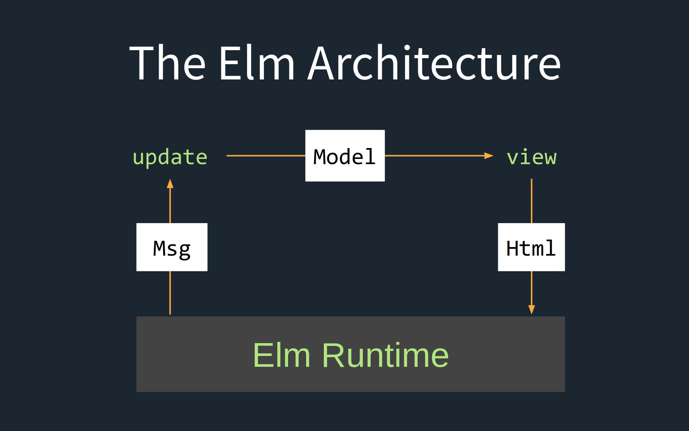

# Elm language

_ProPa, Herbst 2021, Oliver Bucher_

## Technische Übersicht

- Open source
- pure funktionale Sprache
- Domänen spezifisch -> Web
- Statisches Typensystem
- JavaScript Interop
- Compiler geschrieben in Haskell

### Inspiriert von

- Haskell
- F#
- Standard ML
- OCaml

### hat inspiert

- moderne Javascript-Frameworks

---

## in Kürze

- Designed von Evan Czaplicki im Jahr 2012
- die US-Firma NoRedInk hat ihn angestellt, um Elm weiterzuentwickeln

---

## Vergleich mit Haskell

- Typen
- Currying
- Listen
- Anonyme Funktionen
- Pattern Matching
- Rekursion

---

## Wieso eine weitere funktionale Sprache?

- Elm hat sich auf das Web spezialisiert
- Html-Beispiel
- Counter-Beispiel

---

## Architektur

---

## Live Coding

- Todo Web-Applikation
- Implementation Lösch-Aktion

---

## Links

- https://elm-lang.org/
- https://github.com/Level8Broccoli/elm-app
